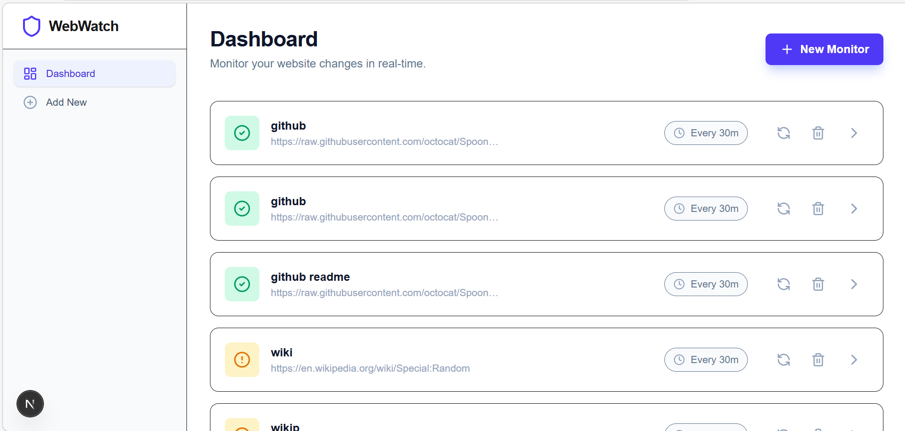
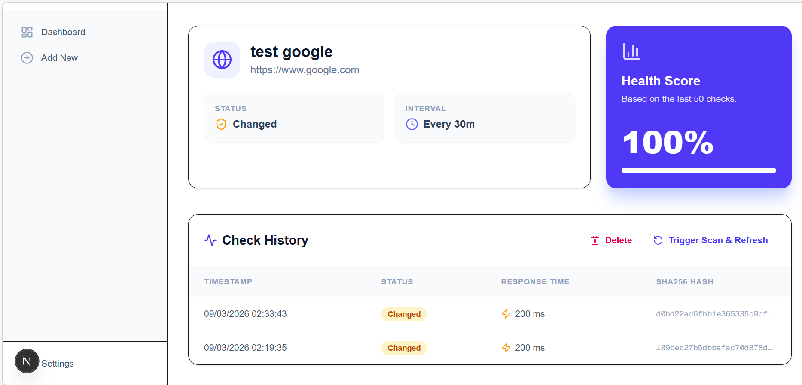

# WebWatch SaaS 

WebWatch is a powerful, modern Website Monitoring SaaS designed to track changes in website content in real-time. It leverages **Next.js**, **Express**, and **n8n** to provide a seamless monitoring experience with automated workflows and premium UI.





##  Features

- **Real-time Monitoring**: Automatically check websites for content changes at custom intervals.
- **Smart Dashboard**: A bird's-eye view of all your monitors with status indicators and health scores.
- **Detailed History**: Track every change with SHA256 hashes, response times, and status logs.
- **n8n Integration**: Industry-standard workflow automation to handle scraping and comparisons.
- **Health Score**: Dynamic calculation of website reliability based on historical data.
- **Manual Triggers**: Force a scan at any time directly from the UI.
- **Delete Management**: Easily remove monitors and their history when no longer needed.

##  Technology Stack

### Frontend
- **Framework**: Next.js 15 (App Router)
- **Styling**: Tailwind CSS
- **Icons**: Lucide React
- **Types**: TypeScript

### Backend
- **Server**: Node.js & Express
- **Database**: SQLite (via Drizzle ORM)
- **Logic**: Clean Service/Route architecture

### Automation
- **Engine**: n8n (Self-hosted or Cloud)
- **Workflow**: Automated scraping, hashing, and response-time tracking.

##  Getting Started

### Prerequisites
- Node.js (v18+)
- n8n installed and running

### Installation

1. **Clone the repository**:
   ```bash
   git clone https://github.com/Meryemeilla/WebWatch-SaaS.git
   cd WebWatch-SaaS
   ```

2. **Setup the Backend**:
   ```bash
   cd backend
   npm install
   # Create a .env file with:
   # N8N_WEBHOOK_URL=http://localhost:5678/webhook/check-monitor
   npm run dev
   ```

3. **Setup the Frontend**:
   ```bash
   cd ../frontend
   npm install
   # Create a .env.local file with:
   # NEXT_PUBLIC_API_URL=http://localhost:4000
   npm run dev
   ```

4. **Import n8n Workflow**:
   Import the JSON file found in `backend/workflow/website_monitor.json` into your n8n instance and update the webhook URLs.

##  Project Structure

```text
├── backend/
│   ├── api/            # Routes and Services
│   ├── db/             # Drizzle Schema and Migrations
│   ├── workflow/       # n8n JSON configurations
│   └── server.ts       # Express Entry point
├── frontend/
│   ├── src/app/        # Next.js Pages
│   ├── src/components/ # Reusable UI Components
│   └── src/lib/        # API communication
└── README.md           # Documentation
```

## License

This project is licensed under the MIT License.

---
*Created with ❤️ for professional website monitoring.*
